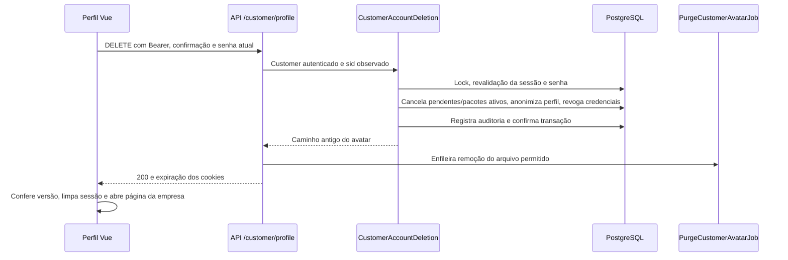

# Cobertura de autenticação e exclusão de contas

Referência de 09/10/2026. Complementa o [guia de autenticação](authentication.md) e registra a revisão do fluxo de exclusão, para orientar futuras telas de proprietário e funcionário. Skills locais aplicadas: `easyslotting-security-review`, `easyslotting-authentication` e `easyslotting-secure-feature`.

## O que cada perfil usa

| Perfil | Login/sessão/logout | Exclusão na interface | API de exclusão própria |
| --- | --- | --- | --- |
| Super admin | Devise Token Auth, helpers staff e layout super admin | Não encontrada | Não há fluxo dedicado; a rota staff legada tem a inconsistência de role descrita abaixo |
| Proprietário (`owner`) | Devise Token Auth, helpers staff e layout admin | Não encontrada | `DELETE /api/me/account` existe, mas rejeita owner com 403 |
| Funcionário (`employee`) | Devise Token Auth, helpers staff e layout admin | Não encontrada | `DELETE /api/me/account` já existe; implementação legada, pendente de revisão antes de criar a tela |
| Cliente (`Customer`) | JWT, helpers de cliente e layout cliente | “Excluir Conta” em `/empresa/:slug/minha-conta` | `DELETE /api/customer/profile`, ajustada nesta revisão |

As páginas privadas usam `services/api.ts`. Todos os pontos de logout encontrados nos layouts, landing e páginas públicas de empresa chamam `logoutStaff()` ou `logoutCustomer()`. As consultas externas de feriados usam `fetch` separado e não são autenticação da aplicação.

Atualização de sessões: clientes possuem múltiplos registros em `customer_sessions`. O serviço de exclusão recebe o `sid` autenticado observado na requisição, revalida-o sob lock e o callback remove **todos** os registros de sessão na mesma transação da anonimização. Falha da auditoria reverte também essa remoção. Logout normal remove só o acesso atual. Consulte a [política por perfil](session-policy.md).

No Rails, controllers administrativos/financeiros/de conta usam `authenticate_user!`, super admin também exige `require_super_admin!`, e a área de cliente usa `authenticate_customer!`. O teste `every protected API controller rejects anonymous access` visita 25 endpoints que cobrem os controllers privados. Outro teste confirma logout/rejeição do token para owner, employee e super admin. As páginas públicas de apresentação, planos, login, recuperação e cadastro continuam acessíveis sem sessão por finalidade do produto.

Essa cobertura confirma os mecanismos e pontos de entrada examinados; não representa auditoria completa de cada regra de negócio ou teste de navegador em todas as telas.

## Achados confirmados e correções na exclusão de cliente

As linhas abaixo apontam a implementação corrigida. O comportamento anterior foi confirmado na revisão do código e das restrições do schema.

| Severidade | Arquivo e linha | Evidência e impacto anterior | Correção |
| --- | --- | --- | --- |
| Alta | `backend/app/services/customer_account_deletion.rb:42` | O controller atribuía `password_digest: nil`, mas o model e o PostgreSQL exigem digest preenchido. A exclusão podia falhar depois de já cancelar reservas. | Substituir o digest por BCrypt de um segredo aleatório descartado e desativar a conta, preservando validações, callbacks e a restrição NOT NULL. A senha antiga deixa de autenticar. |
| Alta | `backend/app/services/customer_account_deletion.rb:10` | Cancelamentos, atualização da conta e auditoria eram operações independentes; erro deixava estado parcial. | Executar alterações sob `with_lock`/transação. Auditoria de sucesso usa `AuditLog.create!` dentro da transação; falha reverte dados e revogação. |
| Alta | `backend/app/controllers/customer/profile_controller.rb:212`; `backend/app/services/customer_account_deletion.rb:16` | Bastavam Bearer e confirmação por e-mail, dado disponível no perfil, para uma ação irreversível. | Exigir senha atual, conferir tipos/tamanhos no servidor, validar senha sob lock, contabilizar erros e bloquear temporariamente após cinco falhas. Throttle adicional por IP. |
| Média | `backend/app/services/customer_account_deletion.rb:43` | A exclusão não limpava explicitamente toda a sessão, recuperação, OTP, confiança e consentimentos. | Limpar `sid`, refresh, recuperação, OTP, lista de confiança, primeiro login e consentimentos; conta inativa e `sid` revogado negam os JWTs anteriores. |
| Média | `backend/app/controllers/customer/profile_controller.rb:228` | Cookies com path `/api/customer_auth` não acompanham `/api/customer/profile`; `cookies.delete` ignora cookies ausentes da requisição. | Emitir expiração com `response.delete_cookie` no path original, inclusive limpeza do CSRF legado em `/`. |
| Média | `backend/app/jobs/purge_customer_avatar_job.rb:4` | Apagar a referência `image` não removia o arquivo público do avatar. | Enfileirar remoção após sucesso, aceitar somente nome gerado para aquele cliente, rejeitar outros IDs, traversal, URL e symlinks, limitar ao diretório de avatares e permitir retry idempotente. |
| Média | `frontend/src/services/api.ts:170`; `frontend/src/views/customer/ProfilePage/CustomerProfilePage.vue:603` | A tela aguardava dois segundos para limpar a sessão e buscava o slug depois de apagá-lo. Resposta antiga também poderia limpar uma conta nova. | Helper de exclusão captura slug/versão, limpa imediatamente após sucesso e devolve destino correto. Versão divergente cancela o efeito local sobre outra conta. |
| Média | `backend/app/services/customer_account_deletion.rb:52`; `frontend/src/views/customer/ProfilePage/CustomerProfilePage.vue:425` | Auditoria copiava nome/e-mail antigos; a tela prometia remover todo histórico, embora os registros fossem preservados. | Novo evento de sucesso contém referência/ação, sem copiar nome/e-mail. Nomes de cliente nos snapshots de agendamento são substituídos. A tela distingue anonimização de perfil e preservação de registros. |

Autorização/IDOR: o alvo é sempre `current_customer`; IDs enviados no payload não selecionam outra conta/empresa. Entrada: e-mail de confirmação string até 254 bytes, senha string de 1–128 bytes, sem sanitização destrutiva da senha. Segredos: não foi identificado segredo/API key hardcoded nos arquivos novos nem alerta do Brakeman; `.env` reais não foram inspecionados. Upload não mudou neste fluxo; a remoção de avatar tem validação própria de caminho/pertencimento.

## Fluxo de referência implementado



O contrato é:

```http
DELETE /api/customer/profile
Authorization: Bearer <access JWT>
Content-Type: application/json
```

```json
{
  "confirmation": "cliente@example.test",
  "current_password": "<senha atual>"
}
```

Retorno 200: `{"message":"Conta excluída com sucesso."}`. Falta de sessão/sessão substituída retorna 401; formato, e-mail de confirmação ou senha incorretos retornam 422; conta bloqueada/throttle retorna 429; erro interno na transação retorna 500 com mensagem genérica.

A confirmação por e-mail é normalizada com `strip.downcase`. A senha permanece exata, inclusive espaços. Erros de senha incrementam o contador compartilhado de `LoginProtection`; cinco erros bloqueiam a ação por 30 minutos. O Rack::Attack também limita a rota a cinco chamadas por IP em 15 minutos.

O serviço cancela agendamentos `pending`/`confirmed` e pacotes `active`, registra data/motivo de cancelamento e preserva registros concluídos. O perfil recebe nome/e-mail substitutos, telefones/foto nulos, estado inativo e dados de autenticação/confiança limpos. O digest aleatório é necessário para a restrição do banco e não guarda a senha anterior.

O alvo é um cliente daquele estabelecimento, não todas as contas com o mesmo e-mail. A exclusão não remove uma conta `User` nem contas `Customer` de outras empresas. Sair da conta e excluir a conta são operações diferentes.

### O que não é apagamento integral

Esta é exclusão lógica com limpeza do perfil, não destruição integral do histórico de negócio. Permanecem IDs, registros de atendimento/pacotes/financeiros, notas e comentários históricos, notificações existentes, auditorias anteriores, backups e possíveis mensagens já entregues. Esses registros podem conter dados pessoais; substituir o nome do perfil não os torna automaticamente anônimos. Retenção ou expurgo adicional precisa de política explícita e implementação por tipo de registro.

O novo evento de auditoria evita duplicar nome/e-mail, mas registra ID, IP e user agent. A revisão técnica não certifica conformidade LGPD. A tela não deve prometer “todos os dados removidos”.

A remoção do avatar depende da fila e do worker. Jobs repetidos são seguros e erros de filesystem têm até cinco tentativas. Se o enfileiramento falhar, a exclusão do banco permanece concluída e há log operacional; o arquivo exige recuperação operacional. URLs externas, nomes legados fora do padrão e arquivos fora do diretório autorizado não são apagados automaticamente.

## Pendências da rota staff antes de uma nova tela

Estes achados estão no fluxo legado de `DELETE /api/me/account`, fora da alteração de exclusão de clientes solicitada. Não use esse fluxo como exemplo pronto:

| Severidade | Arquivo e linha | Achado confirmado | Como corrigir ao implementar |
| --- | --- | --- | --- |
| Média | `backend/app/controllers/account/users_controller.rb:100` | O comentário diz “apenas employees”, mas a condição bloqueia somente owner; super admin não é explicitamente rejeitado. | Definir quais roles podem se excluir e aplicar allowlist no servidor. Se o fluxo for exclusivo de funcionário, exigir `employee?`; preservar administradores/transferência de responsabilidade com regras próprias. |
| Alta | `backend/app/controllers/account/users_controller.rb:89` | A exclusão usa somente confirmação do e-mail; não revalida senha atual. | Reautenticar, validar tipos/tamanhos, limitar tentativas e manter a senha fora dos logs. |
| Alta | `backend/app/controllers/account/users_controller.rb:120` | Memberships e vínculos são removidos antes de desativar a conta, sem transação única. | Serviço transacional com lock, rollback, revogação dos tokens e teste de falha intermediária. |
| Média | `backend/app/controllers/account/users_controller.rb:113` | Auditoria copia nome/e-mail; limpeza de avatar e confiança não segue o fluxo novo do cliente. | Minimizar o evento novo, definir retenção de dados existentes e remover arquivos/credenciais conforme o escopo staff. |

Owner requer decisões de domínio adicionais: transferir ou encerrar estabelecimentos, tratar funcionários, clientes, agendas, assinaturas e registros financeiros. Funcionário requer remanejamento de agendamentos, preservação de comissões/histórico e política para memberships em múltiplas empresas. Excluir um vínculo de equipe não equivale necessariamente a excluir a conta global.

Reuse do exemplo cliente: autenticação e reautenticação no servidor, serviço transacional, consultas pelo ator autorizado, revogação, auditoria mínima, limpeza local protegida por versão e testes. Não copie o cancelamento de todos os registros de cliente para owner/employee sem essas decisões.

## Testes e validação

- Rails: **55 testes, 289 assertions, zero falhas/erros**, usando PostgreSQL de teste `app_test`. Inclui autenticação existente, matriz de 25 endpoints privados, logout das três roles staff, exclusão, IDs de terceiros, senha, bloqueio, rollback, cookies e remoção limitada de avatar.
- Frontend: **10 testes aprovados**, incluindo exclusão, falha de senha preservando sessão e resposta atrasada sem apagar outra conta.
- `npm run build`: type-check e build aprovados; aviso existente de chunk grande.
- Brakeman: **zero alertas e zero erros** no relatório local `backend/tmp/account-deletion-brakeman.json`; Ruby Windows mantém aviso de `Process.fork` não suportado.
- Sem migration adicional nesta revisão. Sem teste de navegador/deploy na VM, commit ou push nesta etapa.

Arquivos principais para futuras features:

- [CustomerAccountDeletion](../backend/app/services/customer_account_deletion.rb), [controller de perfil](../backend/app/controllers/customer/profile_controller.rb) e [job do avatar](../backend/app/jobs/purge_customer_avatar_job.rb).
- [Helper Vue de exclusão](../frontend/src/services/api.ts) e [tela de perfil](../frontend/src/views/customer/ProfilePage/CustomerProfilePage.vue).
- [Testes da exclusão](../backend/test/integration/customer_account_deletion_test.rb), [teste do job](../backend/test/jobs/purge_customer_avatar_job_test.rb), [autenticação Rails](../backend/test/integration/authentication_sessions_test.rb) e [testes frontend](../frontend/tests/authentication.test.mjs).

A reautenticação de ações sensíveis segue a orientação de [autenticação da OWASP](https://cheatsheetseries.owasp.org/cheatsheets/Authentication_Cheat_Sheet.html#require-re-authentication-for-sensitive-features). Atomicidade e separação de efeitos externos são fundamentadas na [documentação de transações do Active Record](https://api.rubyonrails.org/classes/ActiveRecord/Transactions/ClassMethods.html).
