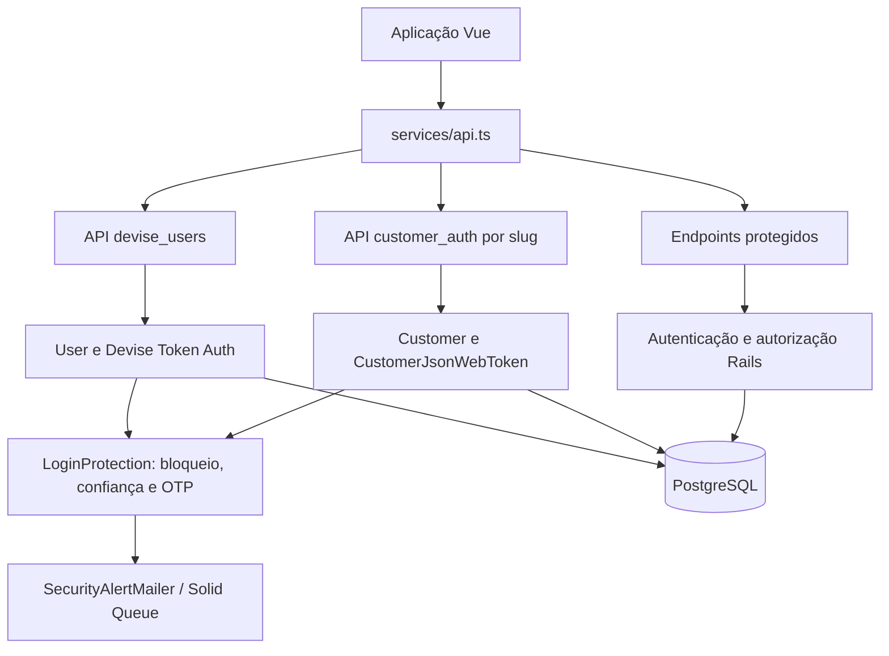
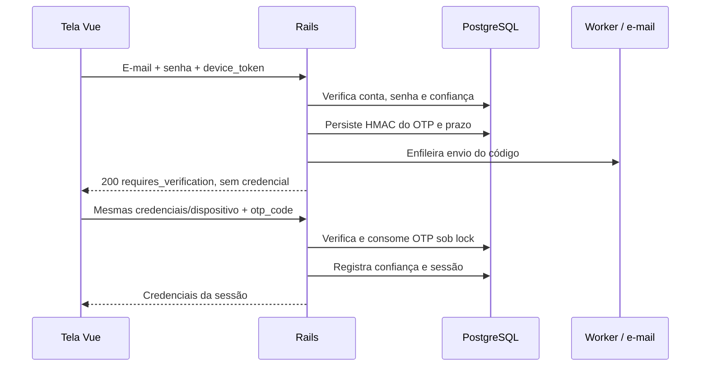

# Autenticação, sessão e logout do EasySlotting

Referência técnica da implementação de 09/10/2026, para manutenção e novas funcionalidades. Este documento cobre cadastro, login da equipe e dos clientes, primeiro acesso, dispositivo confiável, OTP por e-mail, tokens, renovação, revogação, recuperação de senha e integração Rails/Vue/PostgreSQL.

O [relatório de revisão](authentication-security-review.md) registra os problemas corrigidos e a validação realizada. Para infraestrutura, consulte [ambientes](environments.md), [staging na VM](staging-local.md) e [produção na Hostinger](hostinger-vps.md). A referência de comportamento é o código; ao alterar um contrato, atualize este documento e os testes correspondentes.

A [referência de exclusão de contas](account-deletion.md) detalha o fluxo seguro dos clientes, a cobertura por role e as pendências da API staff para futuras telas de owner/funcionário.

O [guia de sessões owner por plano](owner-sessions.md) documenta o limite de 1 a 4 acessos da mesma conta, a tela de dispositivos e o comportamento de redução de plano.

A [política de sessões por perfil](session-policy.md) atualiza esse benefício para funcionários, super admin único e múltiplas sessões independentes dos clientes.

## Índice

- [Arquitetura e tipos de conta](#arquitetura-e-tipos-de-conta)
- [Mapa dos arquivos](#mapa-dos-arquivos)
- [Cadastro e primeiro acesso](#cadastro-e-primeiro-acesso)
- [Dispositivos e OTP](#dispositivos-e-otp)
- [Sessão da equipe](#sessão-da-equipe)
- [Sessão do cliente](#sessão-do-cliente)
- [Logout e revogação](#logout-e-revogação)
- [Senhas e recuperação](#senhas-e-recuperação)
- [Contratos da API](#contratos-da-api)
- [Banco de dados e concorrência](#banco-de-dados-e-concorrência)
- [Autorização e isolamento](#autorização-e-isolamento)
- [Configuração e privacidade](#configuração-e-privacidade)
- [Como adicionar funcionalidades](#como-adicionar-funcionalidades)
- [Testes e publicação](#testes-e-publicação)
- [Diagnóstico e limites atuais](#diagnóstico-e-limites-atuais)

## Arquitetura e tipos de conta

Existem dois mecanismos de autenticação independentes. Uma credencial de cliente não autoriza acesso administrativo e uma credencial de equipe não substitui o JWT do cliente.

| Aspecto | Equipe, proprietários e super admins | Clientes dos estabelecimentos |
| --- | --- | --- |
| Model/tabela | `User` / `users` | `Customer` / `customers` |
| Autenticação | Devise + Devise Token Auth | BCrypt + JWT próprio |
| Identidade | E-mail do usuário | E-mail dentro de um estabelecimento |
| Perfis permitidos no login | `owner`, `employee`, `super_admin` | Conta `Customer`, sem role administrativa |
| Credencial nas chamadas | Headers `access-token`, `client`, `uid` | `Authorization: Bearer <access_token>` |
| Validação pelo servidor | Conta ativa, token, role e permissões aplicáveis | Assinatura/claims, conta e estabelecimento ativos, sessão vigente |
| Duração | Token com prazo de 2 horas, renovado pela rotação | Access token de 15 minutos; refresh de 7 dias |
| Sessões por conta | Owner/employee: 1 a 4 pelo plano do proprietário, quota independente por pessoa (fallback 1); super admin único: até 5 | Sem teto comercial de aparelhos, com sessões independentes |
| Estado no navegador | Access token em memória; metadados em `sessionStorage` | Access token, CSRF e perfil mínimo em `sessionStorage`; refresh em cookie HttpOnly |

Os tokens da equipe são tokens opacos gerenciados pelo Devise Token Auth, não JWTs. Os JWTs de cliente incluem estado de sessão consultado no banco, portanto não são aceitos apenas por terem assinatura válida.



## Mapa dos arquivos

Os caminhos são relativos à raiz do repositório. As pastas `models/core` e `models/concerns` não alteram os nomes das classes `User` e `Customer`.

### Backend

| Arquivo | Responsabilidade |
| --- | --- |
| [config/routes.rb](../backend/config/routes.rb) | Rotas de login, cadastro, renovação, logout, perfil e sessões |
| [application_controller.rb](../backend/app/controllers/application_controller.rb) | Tenant autorizado, permissões, política de senha, rejeição de credenciais na URL e cache sensível |
| [concerns/login_input.rb](../backend/app/controllers/concerns/login_input.rb) | Tipos, formatos e tamanhos de entrada do login |
| [concerns/login_protection.rb](../backend/app/models/concerns/login_protection.rb) | Primeiro login, IP/dispositivo, bloqueio e geração/consumo de OTP |
| [devise_users/sessions_controller.rb](../backend/app/controllers/devise_users/sessions_controller.rb) | Login/OTP/logout da equipe e metadados de sessão |
| [customer_auth/sessions_controller.rb](../backend/app/controllers/customer_auth/sessions_controller.rb) | Login/OTP de cliente, emissão, refresh, cookies e logout |
| [concerns/customer_authenticatable.rb](../backend/app/controllers/concerns/customer_authenticatable.rb) | Resolução do Bearer, validação da sessão e `authenticate_customer!` |
| [core/user.rb](../backend/app/models/core/user.rb) | Conta staff, Devise, invalidação por senha e serialização segura |
| [core/customer.rb](../backend/app/models/core/customer.rb) | Conta de cliente, BCrypt, sessão vigente e serialização segura |
| [customer_json_web_token.rb](../backend/app/services/customer_json_web_token.rb) | Assinatura e validação estrita dos JWTs |
| [account/users_controller.rb](../backend/app/controllers/account/users_controller.rb) | Troca de senha staff, listagem e revogação de sessões próprias |
| [customer/profile_controller.rb](../backend/app/controllers/customer/profile_controller.rb) | Perfil, troca de senha, avatar e operações da própria conta |
| [customer_account_deletion.rb](../backend/app/services/customer_account_deletion.rb) / [purge_customer_avatar_job.rb](../backend/app/jobs/purge_customer_avatar_job.rb) | Exclusão transacional de cliente, reautenticação/revogação e remoção limitada de avatar |
| [password_strength_validatable.rb](../backend/app/models/concerns/password_strength_validatable.rb) | Política compartilhada de força e não reutilização da senha anterior |
| [account/onboarding_controller.rb](../backend/app/controllers/account/onboarding_controller.rb) | Cadastro transacional de owner, estabelecimento e vínculo |
| [devise_users/registrations_controller.rb](../backend/app/controllers/devise_users/registrations_controller.rb) | Cadastro staff como owner, sem autenticação automática |
| [customer_auth/registrations_controller.rb](../backend/app/controllers/customer_auth/registrations_controller.rb) | Cadastro de cliente no estabelecimento e consentimentos |
| [devise_users/passwords_controller.rb](../backend/app/controllers/devise_users/passwords_controller.rb) / [customer_auth/passwords_controller.rb](../backend/app/controllers/customer_auth/passwords_controller.rb) | Solicitação e consumo de links de redefinição |
| [security_alert_mailer.rb](../backend/app/mailers/security_alert_mailer.rb) | OTP e alertas de segurança |
| [audit_logger.rb](../backend/app/services/audit_logger.rb) | Auditoria de login, falhas, logout e informações de dispositivo/localização |
| [devise_token_auth.rb](../backend/config/initializers/devise_token_auth.rb) / [devise.rb](../backend/config/initializers/devise.rb) | Rotação, duração, número de sessões e configuração Devise |
| [customer_jwt.rb](../backend/config/initializers/customer_jwt.rb) | Chaves e prazos dos JWTs de cliente |
| [rack_attack.rb](../backend/config/initializers/rack_attack.rb) | Limites por IP/conta e resposta 429 |
| [cors.rb](../backend/config/initializers/cors.rb) / [filter_parameter_logging.rb](../backend/config/initializers/filter_parameter_logging.rb) | Origens, headers expostos e filtragem de dados sensíveis |
| [config/application.rb](../backend/config/application.rb) | Desativa registro dos argumentos de jobs |
| [db/seeds/runtime.rb](../backend/db/seeds/runtime.rb) | Bootstrap idempotente do plano e super admin explicitamente configurado |
| [20261009120000_harden_login_sessions.rb](../backend/db/migrate/20261009120000_harden_login_sessions.rb) | Novos campos e preparação dos dados anteriores |

### Frontend

| Arquivo | Responsabilidade |
| --- | --- |
| [services/api.ts](../frontend/src/services/api.ts) | Axios, credenciais, rotação, refresh compartilhado, versão da sessão e helpers de logout |
| [services/staffAuth.ts](../frontend/src/services/staffAuth.ts) | Token staff em memória e limpeza de estado |
| [services/customerAuth.ts](../frontend/src/services/customerAuth.ts) | Sessão de cliente, expiração, CSRF e atualização do perfil mínimo |
| [services/storageKeys.ts](../frontend/src/services/storageKeys.ts) | Chaves padronizadas, incluindo identificador de dispositivo |
| [router/index.ts](../frontend/src/router/index.ts) | Navegação por perfil, slug e senha expirada; controles de interface |
| [landing/LoginPage](../frontend/src/views/landing/LoginPage/LoginPage.vue) / [public/LoginPage](../frontend/src/views/public/LoginPage/CustomerLoginPage.vue) | Formulários staff/cliente e desafio OTP |
| [landing/SignUpPage](../frontend/src/views/landing/SignUpPage/SignUpPage.vue) / [public/SignUpPage](../frontend/src/views/public/SignUpPage/CustomerSignUpPage.vue) | Cadastro seguido de encaminhamento ao login |
| [landing/ForgotPasswordPage](../frontend/src/views/landing/ForgotPasswordPage/ForgotPasswordPage.vue) / [landing/ResetPasswordPage](../frontend/src/views/landing/ResetPasswordPage/ResetPasswordPage.vue) | Solicitação e redefinição de senha staff |
| [landing/CustomerForgotPasswordPage](../frontend/src/views/landing/CustomerForgotPasswordPage/CustomerForgotPasswordPage.vue) / [landing/CustomerResetPasswordPage](../frontend/src/views/landing/CustomerResetPasswordPage/CustomerResetPasswordPage.vue) | Recuperação de cliente dentro do slug |
| [admin/Layout](../frontend/src/views/admin/Layout/AdminLayout.vue) / [super-admin/Layout](../frontend/src/views/super-admin/Layout/SuperAdminLayout.vue) | Logout staff e, no admin, troca obrigatória de senha |
| [customer/Layout](../frontend/src/views/customer/Layout/CustomerLayout.vue) / [customer/ProfilePage](../frontend/src/views/customer/ProfilePage/CustomerProfilePage.vue) | Logout, troca obrigatória, perfil e nova autenticação após troca de senha |
| [landing/LandingPage](../frontend/src/views/landing/LandingPage/LandingPage.vue), [public/HomePage](../frontend/src/views/public/HomePage/PublicHomePage.vue) e [public/BookingPage](../frontend/src/views/public/BookingPage/PublicBookingPage.vue) | Pontos adicionais que usam os helpers centralizados de logout |

## Cadastro e primeiro acesso

1. O cadastro valida e persiste a conta. No onboarding empresarial, owner, estabelecimento, endereço e membership são criados dentro de uma transação.
2. O cadastro não emite credenciais de sessão nem registra dispositivo como confiável. A tela encaminha para login.
3. O login valida e-mail, senha, estado da conta e tipo de acesso. O servidor decide se precisa de OTP.
4. Se `first_login_at` estiver vazio e as credenciais forem válidas, o primeiro login é permitido sem OTP. Após sucesso, o servidor registra o primeiro acesso, o IP observado e o identificador de dispositivo válido, quando enviado.
5. Em logins seguintes, IP e identificador de dispositivo precisam ser conhecidos; caso contrário, é solicitado OTP antes da emissão de credenciais.

O primeiro cadastro público não se torna super admin. Os cadastros staff fixam `role: 'owner'` no servidor; clientes são registros `Customer`. O super admin de staging/produção é criado pelo bootstrap com `BOOTSTRAP_ADMIN_EMAIL` e `BOOTSTRAP_ADMIN_PASSWORD`. O bootstrap não promove uma conta comum existente nem substitui a senha de um administrador existente. Sua execução está ligada aos seeds de runtime; `db:prepare` aplica migrações e usa seeds ao inicializar o banco, não recria o administrador em cada login ou deploy.

O primeiro acesso sem OTP é uma decisão deste produto: ele comprova a senha e registra o navegador inicial, mas não comprova o controle da caixa de e-mail. `User` não habilita atualmente o módulo Devise `:confirmable`. Se a confirmação de e-mail se tornar obrigatória, ela exige um fluxo próprio no servidor e testes antes de liberar o primeiro token.

## Dispositivos e OTP

### Identificador e confiança

`getOrCreateDeviceToken()` gera 32 bytes com `crypto.getRandomValues`, representados por 64 caracteres hexadecimais. A chave local é `easyslotting_device_token`. As telas de login enviam esse valor em `device_token`; a API também aceita `X-Device-Token`, com preferência pelo header.

O identificador não é uma senha nem concede acesso sozinho. O servidor aceita de 8 a 64 caracteres alfanuméricos, `_` ou `-` e armazena `device:<SHA256 do identificador>`, nunca seu valor puro, na lista `trusted_ips`. Essa lista contém IPs e hashes de dispositivos, com máximo de 30 entradas combinadas, não 30 aparelhos.

O código atual exige que o IP esteja na lista **e** que o hash do dispositivo esteja na lista. A lista não modela pares exclusivos de IP/dispositivo. Para um histórico por aparelho, com expiração e revogação individual de confiança, será necessária uma estrutura própria de dispositivos.

O IP vem de `request.remote_ip`. A configuração de proxy precisa preservar o endereço observado corretamente. Compartilhar o Wi-Fi não torna outro aparelho confiável. Não existe exceção de autenticação para IP privado/LAN. Auditoria e geolocalização não são fontes de autorização.

### Desafio por e-mail



| Regra | Implementação atual |
| --- | --- |
| Formato | 6 dígitos, inclusive zeros à esquerda; enviar como string |
| Validade | 10 minutos |
| Reenvio | Intervalo mínimo de 60 segundos |
| Erros | No máximo 5 tentativas incorretas por código |
| Armazenamento | HMAC SHA256 com `Rails.application.secret_key_base` |
| Vínculo | Classe/ID da conta, código, IP e identificador de dispositivo |
| Consumo | Uso único; verificação e limpeza sob `with_lock` |
| Entrega | `SecurityAlertMailer.login_verification_code(...).deliver_later` |

Reenviar o login sem `otp_code` durante o cooldown devolve o desafio existente sem disparar outro e-mail. Após o intervalo, a geração de um novo código substitui o anterior e inicia o contador do novo desafio. O código deve ser enviado com o mesmo IP e identificador usados ao pedir o desafio; mudança de rede no meio do fluxo pode invalidá-lo.

O estado `requires_verification: true` com HTTP 200 significa **desafio pendente**, não login concluído. A tela só salva a sessão depois de receber credenciais. O método `totp` anunciado na resposta staff está inativo (`active: false`, “Em breve”); aplicativo autenticador ainda não está implementado.

### Bloqueio e rate limiting

`LoginProtection` mantém contadores no banco: 5 falhas de senha bloqueiam a conta por 30 minutos. As operações de contador usam lock; após expiração do bloqueio, uma nova falha inicia outro ciclo. A autenticação bem-sucedida reinicia os erros de senha. O contador de OTP é separado.

O Rack::Attack limita requisições, inclusive tentativas válidas e verificações de OTP:

| Regra relacionada à autenticação | Limite |
| --- | --- |
| Requisições gerais por IP | 100/minuto |
| Login staff por IP e por e-mail | 5/minuto em cada regra |
| Login cliente por IP e por e-mail dentro do slug | 5/minuto em cada regra |
| Refresh de cliente por IP | 10/minuto |
| Solicitação de recuperação por IP | 3/5 minutos |
| Troca de senha por IP | 5/10 minutos |

O limitador de e-mail lê JSON de até 4096 bytes, normaliza o endereço, usa SHA256 na chave e rebobina o corpo para o controller. Isso não é um limite global de tamanho do corpo HTTP. Há outras regras no initializer. Throttle retorna 429 e `Retry-After`; bloqueio staff também usa 429, enquanto conta de cliente bloqueada retorna 403. Em testes com vários aparelhos atrás do mesmo IP, os limites por IP são compartilhados.

## Sessão da equipe

No sucesso de `POST /api/devise_users/sign_in`, o JSON contém `data` do usuário, incluindo `password_expired`. A credencial vem nos headers `access-token`, `client` e `uid`. O frontend salva o token com `setStaffAccessToken()` e os metadados em `sessionStorage`.

Nas chamadas protegidas, `api.ts` envia os três headers. O Devise Token Auth faz rotação, com prazo de duas horas e buffer de cinco segundos para chamadas em lote. Owner e cada employee herdam de uma a quatro vagas pelo plano do proprietário; a conta única super admin tem cinco. Emissão/rotação/revogação usam lock e preservam metadados. Ao atingir o limite, o login excedente retorna 409 sem expulsar acessos válidos. Consulte a [política por perfil](session-policy.md).

O interceptor só aplica headers de rotação quando a resposta ainda pertence à sessão atual. Headers de token vazios ou só com espaços, possíveis em respostas de lote, não apagam o token válido. As operações que alteram o mapa de sessões usam lock para preservar alterações concorrentes.

O access token staff permanece apenas na memória JavaScript. Um recarregamento completo da página perde esse token e exige login novamente; metadados sozinhos não recuperam a autenticação. Um novo mecanismo de persistência exige projeto próprio de sessão/refresh, em vez de simplesmente colocar o token em `localStorage`.

## Sessão do cliente

### Emissão e armazenamento

O login procura a conta pelo e-mail dentro do estabelecimento ativo identificado pelo slug. E-mails iguais em empresas diferentes representam contas distintas. Se a conta não existe, uma comparação BCrypt simulada reduz diferenças de tempo de resposta.

Após senha/OTP válidos, o servidor gera UUID `sid`, access JWT e refresh JWT. Cria um registro em `customer_sessions` com hashes SHA256 de refresh/CSRF e expiração absoluta em sete dias. Um novo login preserva os outros aparelhos, sem teto comercial. As colunas legadas de sessão única não autorizam mais JWTs; sessões anteriores à mudança exigem novo login.

| Dado | Local | Uso |
| --- | --- | --- |
| Access JWT | `sessionStorage['customer-access-token']` | Bearer nas chamadas `/customer/*` |
| CSRF recebido no JSON | `sessionStorage['customer-csrf-token']` | Header `X-CSRF-Token` |
| Slug autenticado | `sessionStorage['customer-slug']` | Refresh/logout da conta correta |
| Expiração local | `sessionStorage['customer-token-expires']` | Antecipar refresh, sem autorizar no servidor |
| Perfil mínimo | `sessionStorage['customer-data']` | ID, nome, imagem, estabelecimento e flag de senha expirada |
| Refresh JWT | Cookie criptografado `refresh_token`, HttpOnly | Renovação, inacessível ao JavaScript |
| Valor de comparação CSRF | Cookie criptografado `csrf_token`, HttpOnly | Comparação com o header no servidor |

Os dois cookies usam `SameSite=Strict`, path `/api/customer_auth`, duração de sete dias e `Secure` quando a requisição é HTTPS ou o Rails está em produção. O CSRF chega também no JSON, pois o Vue não lê o cookie HttpOnly. O refresh nunca é retornado no JSON.

`saveCustomerSession()` inicia uma sessão local e limpa resíduos anteriores, inclusive em `localStorage`. O argumento `remember` continua na assinatura por compatibilidade, mas não muda o armazenamento nem habilita login persistente. O checkbox atual não cria um modo adicional de sessão para staff ou cliente. Não use sua presença para inferir uma garantia de persistência.

### JWT e validação

Claims de acesso: `customer_id`, `establishment_id`, `sid`, `exp`, `type: 'access'`, `iss: 'easyslotting'`, `aud: 'customer'`. Refresh usa `type: 'refresh'` e inclui `jti` aleatório. A gem verifica assinatura HS256, expiração, emissor, audiência e presença das claims obrigatórias; o serviço verifica o tipo.

`CustomerAuthenticatable` aceita apenas Bearer com formato válido, resolve a conta por ID e estabelecimento e exige `valid_auth_session?(sid)`. Essa verificação confirma conta/estabelecimento ativos e um registro próprio vigente em `customer_sessions`. Headers staff presentes não são usados como autenticação de cliente.

JWT assinado não é criptografado: seu payload pode ser lido. Não adicione senha, OTP, dados pessoais desnecessários nem segredos às claims.

### Renovação

1. `api.ts` antecipa o refresh quando faltam menos de 60 segundos para o prazo local do access token. Também pode renovar após um 401 em rota protegida de cliente, com um único retry.
2. Envia `POST /api/customer_auth/:slug/refresh` com cookies (`withCredentials: true`) e `X-CSRF-Token`. O Bearer atual não é requisito desse endpoint.
3. O servidor verifica CSRF, assinatura/tipo/claims do refresh, slug, sessão vigente, hash armazenado e prazo.
4. Sob lock da conta, substitui os hashes de refresh/CSRF daquela sessão, emite outro access JWT e preserva `sid` e prazo absoluto de sete dias contados do login. A expiração do access nunca ultrapassa esse prazo. Refresh/CSRF de outro aparelho não servem para renovar a sessão.
5. O Vue atualiza access, CSRF e prazo local. Chamadas concorrentes da mesma sessão compartilham uma única promessa de refresh.

Um refresh antigo retorna 401 sem apagar a sessão que já foi renovada. A coordenação de refresh do frontend vale para a instância JavaScript atual, não para todas as abas. Cookies são compartilhados entre abas do mesmo site; chamadas concorrentes entre abas podem disputar a rotação.

Atualizar nome/foto usa `updateCustomerData()`. Reutilizar `saveCustomerSession()` para editar o perfil limparia o CSRF e reiniciaria incorretamente a expiração local.

## Logout e revogação

O logout tem duas partes: encerrar o estado no navegador e revogar a credencial no servidor. Use `logoutStaff()` ou `logoutCustomer()` de `services/api.ts` em todos os botões de sair.

Os helpers capturam credenciais e slug, limpam imediatamente o estado local e fazem o DELETE com Axios fora dos interceptors de rotação/refresh. A limpeza incrementa a versão local da sessão. Respostas atrasadas e retries de uma sessão anterior não podem restaurar tokens nem executar uma requisição antiga com a conta nova.

| Operação | Efeito no servidor |
| --- | --- |
| Logout staff | Remove apenas o `client` autenticado de `User.tokens`; resposta idempotente 200 |
| Revogar sessão staff específica | Remove o client do próprio usuário, sob lock; client inexistente/pertencente a outro usuário retorna 404 |
| Revogar outras sessões staff | Preserva somente o client autenticado atual |
| Trocar/redefinir senha staff | Callback limpa todos os tokens e OTP pendente |
| Logout cliente | Remove somente o registro da sessão autenticada e limpa cookies; outros aparelhos continuam válidos |
| Novo login cliente | Cria um `sid` independente, preservando os anteriores |
| Revogar outras sessões cliente | Preserva apenas o registro autenticado atual |
| Trocar/redefinir senha cliente | Callback remove todas as sessões e limpa credenciais legadas/OTP pendente |

Logout de cliente aceita Bearer válido daquela conta/estabelecimento ou refresh em cookie acompanhado de CSRF válido. Cookies de autenticação são removidos no path original; há limpeza adicional do antigo cookie CSRF no path `/`. O helper usa `customer-slug` da sessão, não o slug da página pública visitada.

Logout não apaga a confiança do dispositivo: sair encerra a sessão, sem obrigar OTP no próximo acesso de IP/dispositivo conhecidos. “Esquecer dispositivo” será uma funcionalidade diferente de revogar tokens.

Sem rede, a limpeza local continua funcionando, mas a revogação remota só pode ser garantida quando a API recebe a requisição. Não trate um erro de rede como confirmação de revogação no servidor.

## Senhas e recuperação

`PasswordStrengthValidatable` verifica mínimo de oito caracteres, maiúscula, minúscula, número, símbolo, termos óbvios, primeiro nome/prefixo do e-mail quando possuem ao menos quatro caracteres e diferença em relação ao digest anterior. Devise e BCrypt também impõem seus limites. O login aceita senha string de 1 a 128 bytes; esse limite de entrada não altera as regras de criação de senha nem os limites do BCrypt.

A senha não passa por `strip`, conversão de caixa ou sanitização HTML no backend de login. E-mail é normalizado com `strip.downcase`. Não sanitize senha como um campo de nome: caracteres e espaços podem fazer parte dela.

### Troca autenticada

- Staff: `PATCH /api/me/change_password`.
- Cliente: `POST /api/customer/profile/change_password`.
- Payload: `current_password`, `password`, `password_confirmation`.
- O servidor confere a senha atual, confirmação e regras do model. A persistência normal aciona a invalidação das credenciais.
- Após sucesso, as telas limpam a sessão e encaminham para novo login.

O produto usa política de expiração em 90 dias a partir de `password_changed_at`. Em geral, GET é permitido com `X-Password-Expired: true`; escrita é bloqueada com 403, `code: 'PASSWORD_EXPIRED'` e `password_expired: true`. Controllers de autenticação e `account/users` são exceções; `customer/profile` também é liberado para permitir manutenção da conta. Não é uma liberação automática para qualquer futura rota de escrita.

Há uma diferença legada a preservar ou unificar explicitamente: o JSON de login marca timestamp ausente como senha expirada, mas os helpers de bloqueio do `ApplicationController` permitem timestamp ausente. Contas novas recebem timestamp nos callbacks. Ao centralizar a política, trate contas antigas e ajuste os testes; não suponha que os dois caminhos já sejam idênticos. Os 90 dias são uma política da aplicação, não uma declaração de exigência universal de OWASP/LGPD.

### Recuperação por e-mail

| Fluxo | Solicitação | Redefinição | Token |
| --- | --- | --- | --- |
| Staff | `POST /api/devise_users/password` | `PUT /api/devise_users/password` | Devise; prazo de 30 minutos |
| Cliente | `POST /api/customer_auth/:slug/forgot_password` | `PUT /api/customer_auth/:slug/reset_password` | Aleatório, hash SHA256 no banco; prazo de 30 minutos e cooldown de solicitação de 60 segundos |

Solicitar recuperação devolve mensagem genérica para e-mail cadastrado ou desconhecido. Redefinir exige `reset_password_token`, `password` e `password_confirmation`; no cliente, a consulta permanece no estabelecimento do slug. O link é montado com `Rails.configuration.x.frontend_url`, não com URL arbitrária do payload.

`reset_password_token` no link é uma exceção explícita à proibição de credenciais de sessão na URL. É um segredo temporário: evite registrá-lo em analytics, mensagens de console ou compartilhamento de links. Recuperação staff usa entrega síncrona no controller atual; recuperação cliente e OTP usam jobs. Salvar a nova senha revoga as sessões, sem fazer login automático.

## Contratos da API

Todas as rotas abaixo têm prefixo `/api`. Os exemplos usam dados fictícios; não cole tokens reais em documentação ou logs.

### Login comum

```json
{
  "email": "usuario@example.test",
  "password": "<senha informada pelo usuário>",
  "device_token": "<identificador do navegador>"
}
```

Para completar o desafio, repetir a chamada com as mesmas credenciais/dispositivo e adicionar `"otp_code": "012345"`. O servidor não confia em `user_id`, role ou flag de “verificado” enviados pela interface.

Resposta de desafio, sem tokens:

```json
{
  "requires_verification": true,
  "email_masked": "u***@example.test",
  "methods": [{ "id": "email", "name": "Código via E-mail", "active": true }]
}
```

Staff pode incluir também o método TOTP inativo. Sucesso staff: `{"data": {"id": 1, "role": "owner", "password_expired": false}}` mais headers de autenticação; outros campos seguros do usuário podem acompanhar `data`.

Sucesso cliente:

```json
{
  "access_token": "<JWT de acesso>",
  "token_type": "Bearer",
  "expires_in": 900,
  "csrf_token": "<valor para X-CSRF-Token>",
  "customer": { "id": 1, "name": "Pessoa", "establishment_id": 10, "password_expired": false }
}
```

O perfil seguro pode trazer outros campos de perfil. Essa é uma ilustração dos campos usados pelo fluxo, não uma lista exaustiva. Refresh devolve os mesmos campos de credencial/cliente e substitui os cookies.

### Rotas relevantes

| Método e caminho | Uso / autenticação |
| --- | --- |
| `POST /devise_users/sign_in` | Login/OTP staff, público |
| `DELETE /devise_users/sign_out` | Logout do client staff atual |
| `POST /register` | Cadastro owner via Devise, sem sessão; consentimentos booleanos |
| `POST /owner_onboarding` | Cadastro de owner + estabelecimento, sem sessão |
| `POST /customer_auth/:slug/sign_up` | Cadastro cliente; `consent_terms` e `consent_privacy` precisam ser booleanos `true` |
| `POST /customer_auth/:slug/sign_in` | Login/OTP do cliente, público |
| `POST /customer_auth/:slug/refresh` | Cookie de refresh + CSRF |
| `DELETE /customer_auth/:slug/sign_out` | Bearer válido ou cookie + CSRF |
| `GET /me/sessions` | Metadados das sessões do próprio staff |
| `DELETE /me/sessions/:client_id` | Revoga um client próprio |
| `DELETE /me/sessions` | Revoga outros clients staff |
| `PATCH /me/change_password` | Troca autenticada de senha staff |
| `GET /customer/profile` | Perfil do cliente autenticado |
| `DELETE /customer/profile` | Exclusão própria com Bearer, `confirmation` e `current_password`; revoga sessão e expira cookies |
| `POST /customer/profile/change_password` | Troca autenticada de senha do cliente |
| `GET /customer/profile/sessions` | Visualização própria; não equivale a uma tabela de sessões independentes |

A montagem Devise também gera rotas da gem. Consulte `config/routes.rb` e `bundle exec rails routes` antes de integrar uma rota adicional; existir na gem não significa ser usada pelas telas atuais.

### Status e entrada

| Status/estado | Interpretação |
| --- | --- |
| 200 com credenciais | Login/refresh concluído |
| 200 com `requires_verification` | Precisa de OTP; não salvar sessão |
| 201 | Cadastro concluído, seguir para login |
| 400 | Credencial de sessão enviada na query string |
| 401 | Credenciais, OTP ou sessão inválidos/expirados; verificar mensagem e endpoint |
| 403 | Permissão negada, CSRF inválido, senha expirada ou conta de cliente bloqueada |
| 404 | Estabelecimento/recurso não encontrado no escopo permitido |
| 409 com `OWNER_SESSION_LIMIT_REACHED` | Vagas do proprietário ocupadas; não é erro de senha nem login concluído |
| 409 com `STAFF_SESSION_LIMIT_REACHED` | Vagas de funcionário/super admin ocupadas; sem expulsar sessões válidas nem contar erro de senha |
| 422 | Entrada/formato/validação inválidos |
| 429 | Throttle ou bloqueio de conta staff |

Login exige e-mail string de até 254 bytes com formato válido, senha string de 1–128 bytes, OTP ausente ou string com seis dígitos, dispositivo ausente ou string com formato válido. Arrays/objetos no lugar desses campos retornam 422. Enviar dispositivo é recomendado: sem identificador válido persistido, acessos seguintes não satisfazem a regra de confiança.

Nas chamadas públicas reconhecidas pelas telas atuais, `api.ts` não anexa credenciais antigas a login, cadastro, onboarding ou recuperação/redefinição. Nas novas telas, use caminhos relativos a essa instância (`/customer/profile`, por exemplo); os interceptors classificam as rotas por prefixo/sufixo. Um endpoint novo fora dessa convenção precisa de classificação explícita e testes. O alias backend `/register`, por exemplo, não consta atualmente de `isPublicAuth`; se uma nova tela passar a usá-lo, ajuste essa classificação e teste a ausência de credenciais antigas.

## Banco de dados e concorrência

| Campo | Onde | Significado |
| --- | --- | --- |
| `first_login_at` | User e Customer | Primeiro login concluído, distinto da criação da conta |
| `trusted_ips` | Ambos, JSONB | Lista limitada de IPs e hashes de dispositivos conhecidos |
| `failed_attempts`, `locked_at` | Ambos | Erros de senha e bloqueio temporário |
| `login_otp_code` | Ambos | HMAC do desafio, apesar do nome legado “code” |
| `login_otp_sent_at`, `login_otp_attempts` | Ambos | Prazo/cooldown e erros do OTP |
| `password_changed_at` | Ambos | Referência da política de senha |
| `tokens` | User | Mapa de clients Devise Token Auth e metadados |
| `auth_session_id` | Customer | Coluna legada, sem autoridade; substituída por `customer_sessions` |
| `refresh_token`, `refresh_token_expires_at` | Customer | Colunas legadas, sem autoridade de autenticação |
| `session_id`, `customer_id`, `expires_at` | CustomerSession | Identidade, dono e prazo absoluto da sessão |
| `refresh_token_digest`, `csrf_token_digest` | CustomerSession | Hashes SHA256 dos segredos da sessão |

`with_lock` usa transação e lock da linha PostgreSQL. Ele protege contadores, consumo de OTP, registro de confiança, emissão/rotação de sessão do cliente e alterações do mapa de sessões staff. Não faça read-modify-write desses campos em instâncias antigas sem lock/reload.

As invalidações por mudança de senha são callbacks dos models. `update_columns`/SQL direto pulam callbacks: não use essas operações para trocar senha, salvo procedimento explícito que também revogue as credenciais. `as_json`/`as_safe_json` excluem hashes de senha, tokens internos, OTP, confiança e controle de sessão; preservar essas exclusões é parte do contrato.

A migration `20261009120000_harden_login_sessions` adiciona `first_login_at` e `login_otp_attempts` nas duas tabelas e `auth_session_id` em clientes. Contas com `trusted_ips` não vazio recebem `first_login_at = updated_at`, para não ganharem um novo primeiro acesso. OTPs antigos são descartados. Contas e estabelecimentos não são apagados.

## Autorização e isolamento

Autenticar comprova a identidade; autorizar decide se essa identidade pode realizar a operação. Toda autorização fica no Rails. Guards do Vue, role/permissões no storage, slug, botões ocultos e headers de estabelecimento são apenas entradas ou controles da interface.

- Staff: `authenticate_user!`, depois `set_establishment` e o `require_*` adequado. Usuários comuns só selecionam estabelecimento ativo próprio ou com membership ativo. `X-Establishment-ID`/`establishment_id` selecionam dentro desse escopo, não concedem acesso.
- Super admin: `authenticate_user!` e `require_super_admin!`. Acesso amplo é uma regra explícita de servidor. Não aceite role privilegiada no cadastro/payload.
- Cliente: `authenticate_customer!`; o tenant deriva do JWT validado e do registro `Customer`. Recurso próprio parte de `current_customer` ou do estabelecimento já autorizado.
- IDs relacionados também precisam de escopo: autorizar um agendamento não autoriza qualquer `service_id`, funcionário ou pacote recebido no payload.

Exemplos existentes para consultar ao implementar: [Admin::ServicesController](../backend/app/controllers/admin/services_controller.rb) e [Customer::AppointmentsController](../backend/app/controllers/customer/appointments_controller.rb).

```ruby
# Exemplo dentro de uma ação que já executou authenticate_customer!:
appointment = current_customer.appointments.find(params[:id])

# Exemplo administrativo, após autenticação, set_establishment e permissão:
service = @establishment.services.find(params[:id])
```

Evite `Appointment.find(params[:id])` seguido de confiança em um `customer_id` do formulário. Não use um endpoint global de consulta por ID para contornar o escopo. Teste sempre outra conta e outro estabelecimento.

## Configuração e privacidade

### Pontos de configuração

Não há valores reais de ambiente neste documento e arquivos `.env` não foram inspecionados para esta referência.

| Configuração | Onde consultar / efeito |
| --- | --- |
| `CUSTOMER_JWT_SECRET`, `CUSTOMER_JWT_REFRESH_SECRET` | `customer_jwt.rb`; obrigatórios quando `RAILS_ENV=production`, incluindo staging |
| `SECRET_KEY_BASE` / segredo Rails | Cookies criptografados e HMAC do OTP; trocar invalida dados dependentes do segredo |
| `FRONTEND_URL` | Links de recuperação; produção/staging exigem HTTPS |
| `ALLOWED_ORIGINS`, `ALLOWED_HOSTS` | CORS e hosts autorizados; manter origem com esquema/porta corretos |
| `VITE_API_URL` | URL pública da API no build; qualquer `VITE_*` é visível no bundle |
| SMTP / `EMAIL_FROM` | Entrega de OTP e recuperação; detalhes nos guias de ambiente |
| Worker Solid Queue | Executa OTP, recuperação cliente e alertas enfileirados |
| `BOOTSTRAP_ADMIN_EMAIL`, `BOOTSTRAP_ADMIN_PASSWORD` | Criação inicial explícita do super admin no runtime |

O frontend usa `/api` em build de produção se `VITE_API_URL` não estiver definido. Desenvolvimento usa porta 3000 no host local/LAN. Axios envia cookies com `withCredentials: true`. A configuração atual de cookies `SameSite=Strict` favorece frontend/API no mesmo site; separar em sites distintos exige rever cookies, CORS e CSRF conjuntamente.

Os prazos estão em mais de um ponto: `CustomerJwt`, defaults de `CustomerJsonWebToken`, `expires_in`, cookies e fallback local do Vue. Ao alterar duração, mantenha todos coerentes. Política de senha também aparece em helpers, controllers e UI. Para mudanças frequentes, centralize essas regras com testes em vez de editar um único número.

### Dados sensíveis

Respostas autenticadas/de conta/autenticação usam `Cache-Control: no-store` e `Pragma: no-cache`. Query strings com `access-token`, `access_token`, `refresh_token`, `client` ou `uid` são rejeitadas. A filtragem Rails cobre senha, token, OTP e outros campos sensíveis; `config.active_job.log_arguments = false` evita que argumentos de jobs exponham códigos e links nos logs da aplicação.

Não registre objetos Axios completos, headers, cookies, payloads de senha nem corpo de e-mails em logs/telemetria. O código e o link precisam existir no e-mail entregue; o armazenamento da fila e do provedor de e-mail também é sensível e precisa de acesso restrito e política de retenção.

Auditoria registra ações, identidade, IP e user agent; pode incluir localização aproximada. `AuditLogger.geolocate` identifica alguns IPs privados como LAN e consulta `ip-api.com` por HTTPS para outros IPs, com cache de uma hora e fallback em erro. Essa integração é informativa: não libera acesso. Se mudar a política de privacidade, considere o tratamento/compartilhamento de IP e a necessidade dessa consulta externa.

Existe a tarefa `audit:retention`, que remove logs com mais de 90 dias; ela não está agendada em `config/recurring.yml` atualmente. Não suponha que a retenção acontece só por existir a tarefa. Definir agenda, retenção dos jobs/e-mails, avisos de privacidade e base legal exige decisão operacional própria. As proteções técnicas e os consentimentos do cadastro não equivalem a certificação de conformidade LGPD.

## Como adicionar funcionalidades

### Nova página ou endpoint protegido

1. Defina se o ator é staff, super admin ou cliente e quais permissões são necessárias.
2. Crie a rota/controller com autenticação e autorização antes de carregar ou alterar dados. Para staff, selecione o estabelecimento autorizado; para cliente, derive a identidade do JWT validado.
3. Busque recursos e IDs relacionados por associações autorizadas. Crie dados pela associação do tenant, sem aceitar dono/role/tenant arbitrários.
4. Use strong parameters, validações de model, limites de tamanho e queries parametrizadas. Não transforme senhas como texto de apresentação.
5. Consuma a API pelo helper centralizado no Vue. Use guards para navegação, trate 401/403/422/429 e mantenha decisões de acesso no servidor.
6. Para uploads, confira conteúdo real, tamanho, MIME permitido, nome gerado no servidor e reencodificação quando aplicável. Consulte o upload de avatar em `Customer::ProfileController`; não confie só na extensão ou no MIME enviado pelo navegador.
7. Teste conta desativada, outra conta/tenant, permissão ausente, ID de terceiro e payload malformado. Revise segredo em código/bundle e dados sensíveis em logs/respostas.
8. Atualize esta referência e registre riscos/limitações da funcionalidade.

As skills locais `easyslotting-authentication`, `easyslotting-secure-feature` e `easyslotting-security-review` ajudam essa revisão. Elas ficam fora do versionamento conforme a configuração local; não são dependência de runtime nem estarão automaticamente presentes em outra máquina. Esta documentação pode ser versionada para manter a referência junto do projeto.

### Mudança em login, sessão ou logout

| Objetivo | Pontos que devem mudar em conjunto |
| --- | --- |
| Outro método de verificação, como TOTP | Model/armazenamento de segredo e recuperação, verificação server-side, limites, desafio API, UI e testes; marcar `active: true` sozinho não implementa o método |
| Sessões simultâneas independentes para cliente | Tabela de sessões por conta/aparelho; `sid`, hash/prazo por sessão; resolver JWT, refresh, logout, revogação e troca de senha; substituir estado único em `Customer` |
| “Esquecer aparelho” | Registro/revogação de confiança, distinto da sessão; exigir nova verificação nos próximos logins sem alterar `first_login_at` para simular primeira conta |
| Persistência de login staff | Novo desenho de restauração/refresh e cookies/CSRF; preservar revogação, rotação e proteção contra respostas antigas |
| Prazo de sessão diferente | Configuração JWT/Devise, encoder, cookies, resposta e expiração local; testes de limite temporal |
| Novo endpoint público de autenticação | `LoginInput` quando aplicável, rate limiting, classificação de `api.ts`, cache, filtragem e exceções de senha; impedir credenciais antigas na chamada |
| Mudança no perfil de cliente | `updateCustomerData`, sem reiniciar sessão, prazo ou CSRF |
| Novo ponto de logout | Reutilizar `logoutStaff`/`logoutCustomer`, limpar antes de esperar rede e tratar falha remota explicitamente |

Preserve estes requisitos ao refatorar: desafio não emite token; OTP é de uso único e limitado; token revogado não volta por resposta atrasada; requisição antiga não migra para nova conta; retry de refresh é limitado; refresh antigo não revoga sessão nova; consultas ficam no tenant autorizado; troca de senha revoga credenciais no banco.

## Testes e publicação

### Suites de referência

| Arquivo | Cobertura principal |
| --- | --- |
| [login_protection_test.rb](../backend/test/models/login_protection_test.rb) | Confiança, vínculo/prazo/cooldown/consumo do OTP, limites e bloqueio de senha |
| [authentication_sessions_test.rb](../backend/test/integration/authentication_sessions_test.rb) | Roles, login/OTP, headers/cookies/CSRF, claims, refresh/replay, revogação, cadastro, entradas, rate limiting e isolamento |
| [security_hardening_test.rb](../backend/test/integration/security_hardening_test.rb) / [establishment_security_test.rb](../backend/test/integration/establishment_security_test.rb) | Regressões de autorização, dados sensíveis e acesso a outros estabelecimentos |
| [authentication.test.mjs](../frontend/tests/authentication.test.mjs) | Respostas atrasadas, lote, refresh concorrente, logout, troca de conta, chamada pública e atualização de perfil |
| [customer_account_deletion_test.rb](../backend/test/integration/customer_account_deletion_test.rb) / [purge_customer_avatar_job_test.rb](../backend/test/jobs/purge_customer_avatar_job_test.rb) | Exclusão própria, reautenticação, rollback, revogação, cookies e limites de remoção de arquivo |

O frontend usa testes nativos `node --test`, com TypeScript transpilado e mocks de storage/Axios; eles não substituem testes de navegador/API reais. A validação de implementação registrou 44 testes Rails/156 assertions, 7 testes frontend, build aprovado e Brakeman sem alertas. Consulte o relatório para o contexto; esses números não são promessa de resultado em versões futuras.

A revisão seguinte de exclusão de contas ampliou a validação para 55 testes Rails/289 assertions e dez testes frontend, com build aprovado e Brakeman sem alertas. Os detalhes e limites estão na [referência de exclusão](account-deletion.md).

No PowerShell, com PostgreSQL e credenciais de teste já configurados, execute a partir de `backend`:

```powershell
$env:RAILS_ENV = 'test'
$env:TEST_DB_DATABASE = 'app_test'
# Se existir DATABASE_URL para outro ambiente nesta sessão, retire-a antes dos testes.
$env:DATABASE_URL = $null
bundle exec rails db:prepare
bundle exec rails test test/models/login_protection_test.rb test/integration/authentication_sessions_test.rb test/integration/security_hardening_test.rb test/integration/establishment_security_test.rb
```

Esses comandos preparam/usam somente o banco de testes indicado; confirme também host e usuário do banco de teste na configuração da máquina. Não aponte testes para o banco da VM ou de produção. Em outro terminal, a partir de `frontend`:

```powershell
npm test
npm run build
```

Para revisão estática, a partir de `backend`: `bundle exec brakeman --no-pager`. Para listar contratos Rails: `bundle exec rails routes`. Não há necessidade de resetar dados para aplicar a migration.

### Publicação e compatibilidade

Frontend, backend e migration precisam ser publicados juntos. No Compose de staging, `prepare` executa `rails db:prepare` e deve terminar com código 0 antes de `web`/`worker`. O [workflow de staging](../.github/workflows/deploy-staging.yml) chama [scripts/deploy-staging.sh](../scripts/deploy-staging.sh) quando há push em `staging`, usando o runner configurado na VM. Salvar ou commitar localmente não inicia esse deploy.

JWTs anteriores de cliente não têm o novo `sid` e usam o emissor antigo, portanto exigem novo login. A migration descarta OTP pendente antigo; hashes novos de dispositivo podem exigir nova verificação para contas existentes. Ela não remove contas ou estabelecimentos. Faça backup antes de mudanças de schema; rollback não restaura códigos descartados nem torna as credenciais antigas válidas automaticamente. Reverter exige compatibilizar código, schema e política de sessões.

Depois do deploy, verifique primeiro login, OTP, refresh, logout, senha alterada, isolamento e a [matriz por perfil](session-policy.md). Testes de aparelhos diferentes continuam sujeitos a limites por IP; clientes preservam os outros acessos. Não reinicie a VM como substituto de conferir o job/deploy e os logs.

## Diagnóstico e limites atuais

### Roteiro de investigação

| Sintoma | Verificações |
| --- | --- |
| Login retorna 401 | Conta existe no model/tenant correto? E-mail e senha correspondem? OTP expirou, foi consumido ou mudou IP/dispositivo? Não conclua que todo 401 é 2FA |
| Login retorna 422 | Tipos/tamanhos, OTP como string de seis dígitos e formato do dispositivo |
| Retorna `requires_verification`, mas não chega e-mail | Worker, fila e entrega SMTP; em staging, procurar no Mailpit, não na caixa real |
| CSRF retorna 403 | Cookie presente, header correspondente ao último refresh, mesmo host/path e esquema de acesso |
| Outro aparelho perde login de cliente | Novo login não deve derrubá-lo; verificar expiração, revogação, senha/conta alterada e isolamento de `sid`, sem expor tokens nos logs |
| Recarregar página perde login staff | Comportamento do token somente em memória |
| Logout parece não persistir | Usar helper centralizado; conferir DELETE na API, versão da sessão, rede e estado no banco |
| Tela abre, mas operação retorna 403 | Permissão/tenant ativo no Rails ou política de senha; guard Vue não comprova autorização |
| Muitos 429 em testes LAN | Limites por IP são compartilhados por aparelhos; respeitar janela/`Retry-After` |
| Cadastro retorna 500 | Procurar erro no serviço `web`; validação deveria retornar 422. Middleware pode falhar antes do controller; não atribuir ao CNPJ/OTP sem evidência |

Na VM, a partir da pasta do repositório, para diagnóstico sem alterar dados:

```bash
sudo docker compose --env-file backend/.env.staging -f compose.staging.yaml ps --all
sudo docker compose --env-file backend/.env.staging -f compose.staging.yaml logs --since 10m prepare web worker
sudo docker compose --env-file backend/.env.staging -f compose.staging.yaml exec -T web bundle exec rails db:migrate:status
```

O nome do serviço Rails é `web`. Não publique saída contendo dados pessoais, cookies ou credenciais. No staging atual, Mailpit captura e-mails localmente; o [guia da VM](staging-local.md#iniciar-e-acessar-pelo-windows) explica o túnel para abrir a interface.

### Limites que uma próxima feature pode tratar

- Clientes têm sessões independentes entre aparelhos. No mesmo navegador/origem, os cookies continuam compartilhados entre abas; isso não oferece identidades simultâneas independentes em abas da mesma origem.
- A coordenação de respostas/refresh do Vue funciona dentro da instância atual, sem sincronização global de abas.
- O checkbox de lembrar não habilita persistência adicional; staff precisa autenticar após recarregamento completo e cliente depende do estado de `sessionStorage`.
- Identificador de dispositivo é um sinal armazenado no navegador, não atestado físico. XSS pode acessar storage/memória; HttpOnly protege a leitura do refresh, não elimina a necessidade de prevenir XSS.
- Confiança atual usa uma lista limitada, sem tabela de aparelhos, expiração por aparelho ou botão dedicado de “esquecer”.
- TOTP, passkeys e recuperação de segundo fator não estão implementados; primeiro login não exige prova de controle do e-mail.
- Logout offline não garante revogação remota; retenção de auditoria precisa de agendamento operacional.
- Política de senha/prazos tem pontos duplicados e a diferença para timestamp ausente descrita acima.
- Testes automatizados cobrem regressões do código; validação ponta a ponta na VM, entrega real de e-mail e operação contínua precisam ser conferidas no ambiente publicado.
